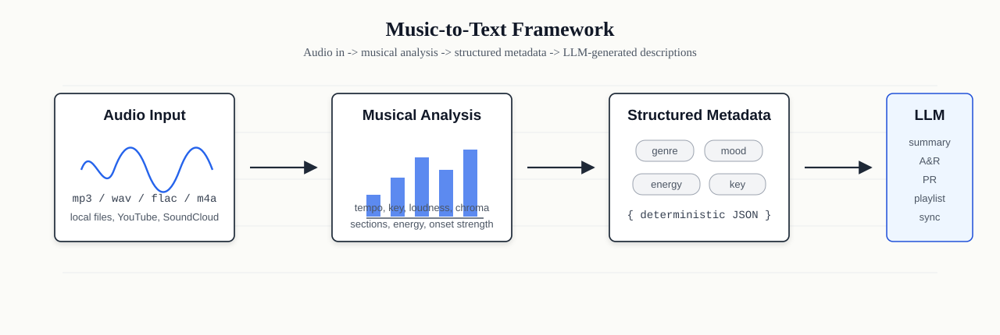

# music-to-text

Text-to-music models are reaching a peak. What about the reverse? Music-to-text helps songs explain themselves.

`music-to-text` is an open-source, local-first Python framework that converts audio into structured musical intelligence and useful text descriptions powered by LLMs.

<p align="center">
  
</p>

## What It Does

- analyzes local audio files, YouTube links, and SoundCloud links
- extracts tempo, loudness, chroma, key estimates, energy, and section-change hints
- generates deterministic local descriptions with `--no-llm`
- optionally calls any OpenAI-compatible chat completion API
- returns structured JSON for catalogs, playlists, A&R notes, PR copy, and sync pitches
- supports folder analysis for local music collections

## Why Music-To-Text Matters

Music catalogs, artists, labels, supervisors, and researchers need language that explains what a track is doing. Today, people still write most of that metadata manually: genre notes, mood tags, playlist pitches, A&R blurbs, and sync descriptions. This project makes that work more reproducible by combining deterministic audio analysis with optional OpenAI-compatible language models.

## Quick Start

This project is intended for local development from the cloned repository. It does not depend on a package existing on PyPI.

```bash
git clone https://github.com/edujbarrios/music-to-text.git
cd music-to-text
python -m venv .venv
source .venv/bin/activate
pip install -e .
```

On Windows PowerShell:

```powershell
python -m venv .venv
.\.venv\Scripts\Activate.ps1
pip install -e .
```

Run without an API key:

```bash
music-to-text examples/song.mp3 --no-llm
```

Run with an OpenAI-compatible API:

```bash
music-to-text examples/song.mp3 --mode pr
```

## CLI

Analyze one file:

```bash
music-to-text examples/song.mp3 --mode json --pretty
music-to-text examples/song.mp3 --mode sync --output sync-pitch.json
music-to-text examples/song.mp3 --format markdown --output report.md
music-to-text examples/song.mp3 --format csv --output track.csv
```

Analyze a YouTube or SoundCloud link:

```bash
music-to-text "https://www.youtube.com/watch?v=VIDEO_ID" --no-llm
music-to-text "https://soundcloud.com/artist/track" --mode playlist
```

Run the Billie Jean executable demo:

```bash
python examples/billiejean_example.py
```

The script analyzes `https://www.youtube.com/watch?v=Zi_XLOBDo_Y`, uses `api_key="unused"` with the example llm7.io OpenAI-compatible endpoint, and writes the result to `examples/billiejean_example.json`. Only run it if you have the right to access and process the media and you comply with the source platform terms.

If YouTube asks yt-dlp to sign in to confirm you are not a bot, the script automatically tries browser cookies from Chrome, Edge, and Firefox. To force a browser where you are signed in:

```powershell
$env:YTDLP_COOKIES_FROM_BROWSER="chrome"
python examples/billiejean_example.py
```

Chrome, Edge, and Firefox are common values. For a specific browser profile, use `browser:profile`, for example:

```powershell
$env:YTDLP_COOKIES_FROM_BROWSER="chrome:Profile 1"
python examples/billiejean_example.py
```

Analyze a folder:

```bash
music-to-text examples/ --no-llm --mode json --pretty
music-to-text examples/ --recursive --output catalog-analysis.json
```

Options:

- `--mode summary|ar|pr|playlist|sync|json`
- `--model`
- `--base-url`
- `--api-key`
- `--no-llm`
- `--output`
- `--pretty`
- `--format text|json|markdown|csv`
- `--download-dir`
- `--cookies`
- `--cookies-from-browser`
- `--recursive`

## Inputs

Local files are the default workflow. When the local environment supports decoding them, MP3, WAV, FLAC, and M4A files can be analyzed.

YouTube and SoundCloud URLs are downloaded locally with `yt-dlp` before analysis:

```bash
music-to-text "https://youtu.be/VIDEO_ID" --no-llm --pretty
music-to-text "https://soundcloud.com/artist/track" --mode pr
music-to-text "https://www.youtube.com/watch?v=VIDEO_ID" --download-dir downloads --mode json
music-to-text "https://www.youtube.com/watch?v=VIDEO_ID" --cookies-from-browser chrome --mode json
```

By default, downloaded URL audio is stored in a temporary folder and removed after analysis. Use `--download-dir` to keep the downloaded file. Only analyze media you have the right to access and process, and follow the terms of the source platform.

Folder analysis processes supported audio files in stable sorted order. Use `--recursive` to include nested folders:

```bash
music-to-text music-folder/ --no-llm --mode json --pretty
music-to-text music-folder/ --recursive --output dataset.json
```

## Python API

```python
from music_to_text import MusicToText

analyzer = MusicToText()
result = analyzer.analyze("song.mp3", mode="summary")
print(result.generated_text.short_description)
```

URLs work the same way:

```python
result = analyzer.analyze("https://soundcloud.com/artist/track", mode="playlist", no_llm=True)
```

Folders can be analyzed with `analyze_many`:

```python
results = analyzer.analyze_many("music-folder", mode="summary", no_llm=True, recursive=True)
```

For local deterministic output without an API key:

```python
result = analyzer.analyze("song.mp3", mode="summary", no_llm=True)
```

## OpenAI-Compatible API Setup

Create an environment file:

```bash
cp .env.example .env
```

Example `.env`:

```env
LLM_API_KEY=your_api_key_here
LLM_BASE_URL=https://api.llm7.io/v1
LLM_MODEL=gpt-4o-mini
```

`llm7.io` is only an example of an OpenAI-compatible API provider. Any OpenAI-compatible API should work, including local or self-hosted endpoints, as long as it exposes a compatible `/chat/completions` API.

You can also pass settings per command:

```bash
music-to-text song.mp3 --base-url http://localhost:8000/v1 --model local-model --api-key local-key
```

## Audio Analysis

The framework extracts:

- duration
- estimated tempo
- loudness proxy
- spectral centroid
- chroma features
- approximate key estimate
- onset strength
- rough energy profile
- approximate section changes
- heuristic mood tags
- heuristic genre hints
- production descriptors

## Outputs

The result contains:

- short description
- detailed A&R-style description
- PR pitch
- playlist pitch
- sync licensing pitch
- genre tags
- mood tags
- instrument and production tags
- structured JSON metadata
- Markdown reports with `--format markdown`
- CSV rows for catalog and dataset workflows with `--format csv`

Example JSON shape:

```json
{
  "source_path": "examples/song.mp3",
  "mode": "summary",
  "features": {
    "duration_seconds": 184.2,
    "tempo_bpm": 122.0,
    "key_estimate": "A major/minor estimate"
  },
  "heuristic_tags": {
    "mood_tags": ["driving", "upbeat"],
    "genre_hints": ["pop", "indie"]
  },
  "generated_text": {
    "short_description": "This track is an approximately 184.2s piece around 122 BPM..."
  },
  "llm_used": false
}
```

## No-LLM Mode

Use `--no-llm` to return extracted features, heuristic tags, and deterministic local text without API calls:

```bash
music-to-text examples/song.mp3 --no-llm --pretty
```

Tests run without API keys.

## Roadmap

- Whisper transcription support
- CLAP, MERT, and MuLan embeddings
- similarity search
- dataset export
- web UI
- plugin system for LLM providers
- evaluation benchmarks for music captioning

## Contributing

Contributions are welcome from the beginning. See [CONTRIBUTING.md](CONTRIBUTING.md), [CODE_OF_CONDUCT.md](CODE_OF_CONDUCT.md), and [SECURITY.md](SECURITY.md).

## License

MIT License. See [LICENSE](LICENSE).
